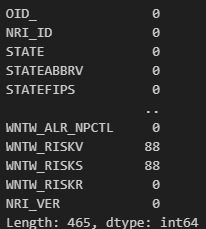
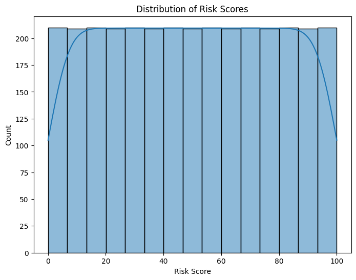
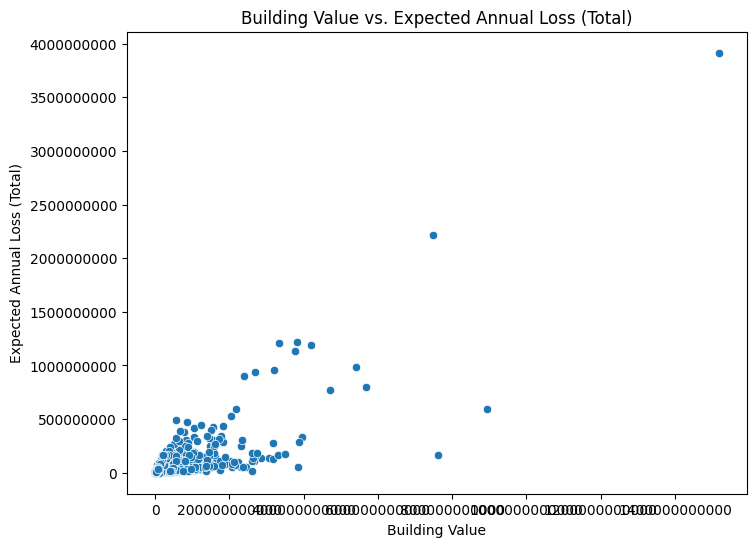
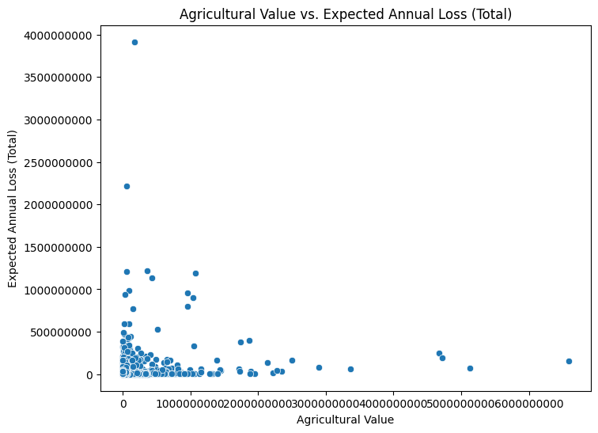

**Joe Hale**

## Executive summary
This data analysis project aims to investigate the economic impact of wildfires in the United States and its territories, and identify the key factors contributing to the economic loss.

The project will follow a structured approach, beginning with data exploration and preprocessing to ensure data quality and consistency. Feature selection and engineering techniques will be applied to identify relevant variables and create new features if necessary. Exploratory data analysis (EDA) will be conducted to gain insights into the data through statistical analysis and visualization.

Machine learning models will be selected based on the project goals, such as regression, classification, or clustering. The models will be trained on the prepared data and evaluated using appropriate performance metrics. Model interpretation will be performed to identify the most important features contributing to the vulnerability assessment.

Visualizations and clear communication of findings will be a key focus, using charts, graphs, maps, and interactive dashboards to present the results effectively. The project will follow an iterative approach, allowing for refinement and improvement based on insights gained and feedback received.

## Expected Outcomes

Identification of the economic impact of wildfires in the United States and its territories.
Determination of the key factors contributing to the economic loss caused by wildfires.
Insights into the patterns, trends, and relationships within the data related to wildfires and their economic consequences.

Actionable recommendations for stakeholders and decision-makers to mitigate the economic impact of wildfires and prioritize resources effectively.

The findings of this project will provide valuable information to policymakers, emergency management agencies, and other relevant stakeholders in understanding the economic implications of wildfires and guiding strategies for risk reduction and resilience building.

## Rationale
Several high-profile fires have devastated small local economies. While there are contributing factors outside of the ignition of a fire, in some cases it's poor management of the area or lacking maintenance of equipment, but the indications of risk can enable decision makers to understand the risks and redirect resources or focus on mitigation.

## Research Question
How have wildfires in the United States and its territories impacted the economy, and what are the key factors contributing to the economic loss?

## Data Sources
I will primarily use the National Risk Index data sources. These data sources include data on floods, natural hazards, and planning and mitigtion. It also includes costs and loss expectations.

## Methodology
1. Data Exploration and Preprocessing:
   - Load the dataset into the python notebook
   - Explore the dataset to understand its structure, features, and variables.
   - Check for missing values, outliers, or any data inconsistencies and handle them appropriately.
   - Perform necessary data cleaning and preprocessing steps.

2. Feature Selection and Engineering:
   - Identify the relevant features or variables that are most important for my analysis.
   - Create new features or combine existing ones if needed to capture relevant information.
   - Consider normalizing or scaling the features if required.

3. Exploratory Data Analysis (EDA):
   - Conduct statistical analysis and visualization to gain insights into the data.
   - Analyze the distribution of variables, correlations, and trends.
   - Create visualizations such as histograms, scatter plots, heatmaps, or geographical maps to understand patterns and relationships.

4. Model Selection and Training:
   - Determine the appropriate machine learning models based on my project goals (e.g., regression, classification, clustering).
   - Split the data into training and testing sets.
   - Train the selected models on the training data and evaluate their performance using appropriate metrics.
   - Fine-tune the models by adjusting hyperparameters or trying different algorithms.

5. Model Evaluation and Interpretation:
   - Assess the performance of the trained models on the testing data.
   - Use evaluation metrics such as accuracy, precision, recall, F1-score, or mean squared error, depending on the problem type.
   - Interpret the model results and identify the most important features or patterns that contribute to the vulnerability assessment.

6. Visualization and Communication:
   - Create informative and visually appealing visualizations to present my findings.
   - Use charts, graphs, maps, or interactive dashboards to communicate the results effectively.
   - Prepare a clear and concise report or presentation summarizing my analysis, key insights, and recommendations.

7. Iterative Refinement:
   - Iterate on the previous steps based on the insights gained and feedback received.
   - Refine my models, incorporate additional data sources, or explore different techniques to improve the analysis.

## Results
My initial assessment of the data shows significant variations in the features based on different areas, and counties, throughout the data set.

### Summary of the data
#### Data Head
   OID_  NRI_ID    STATE STATEABBRV  STATEFIPS   COUNTY COUNTYTYPE  \
0     1  C01001  Alabama         AL          1  Autauga     County   
1     2  C01003  Alabama         AL          1  Baldwin     County   
2     3  C01005  Alabama         AL          1  Barbour     County   
3     4  C01007  Alabama         AL          1     Bibb     County   
4     5  C01009  Alabama         AL          1   Blount     County   

   COUNTYFIPS  STCOFIPS  POPULATION  ...  WNTW_EALS            WNTW_EALR  \
0           1      1001       58764  ...  15.784587             Very Low   
1           3      1003      231365  ...  56.205509  Relatively Moderate   
2           5      1005       25160  ...  18.632002       Relatively Low   
3           7      1007       22239  ...  13.308573             Very Low   
4           9      1009       58992  ...  23.645930       Relatively Low   

      WNTW_ALRB     WNTW_ALRP     WNTW_ALRA WNTW_ALR_NPCTL    WNTW_RISKV  \
0  2.687716e-07  7.410082e-09  8.725777e-06      10.461158   8494.906508   
1  1.268231e-09  2.287120e-08  1.548360e-07      13.339523  65619.701638   
2  5.788050e-07  2.347236e-08  7.606598e-07      16.125039  15501.730335   
3  9.014679e-07  1.270300e-08  1.202015e-05      16.991643   7496.186940   
4  5.268425e-07  1.482016e-08  2.002965e-07      12.039616  17175.160729   

   WNTW_RISKS      WNTW_RISKR     NRI_VER  
0   12.217626        Very Low  March 2023  
1   52.083996  Relatively Low  March 2023  
2   19.535476        Very Low  March 2023  
3   11.104041        Very Low  March 2023  
4   21.444480        Very Low  March 2023  

[5 rows x 465 columns]
#### Data Tail
      OID_  NRI_ID           STATE STATEABBRV  STATEFIPS      COUNTY  \
3226  3227  C72151     Puerto Rico         PR         72     Yabucoa   
3227  3228  C72153     Puerto Rico         PR         72       Yauco   
3228  3229  C78010  Virgin Islands         VI         78   St. Croix   
3229  3230  C78020  Virgin Islands         VI         78    St. John   
3230  3231  C78030  Virgin Islands         VI         78  St. Thomas   

     COUNTYTYPE  COUNTYFIPS  STCOFIPS  POPULATION  ...  WNTW_EALS  \
3226  Municipio         151     72151       30397  ...        0.0   
3227  Municipio         153     72153       34151  ...        0.0   
3228     Island          10     78010       40913  ...        0.0   
3229     Island          20     78020        3882  ...        0.0   
3230     Island          30     78030       41412  ...        0.0   

                      WNTW_EALR  WNTW_ALRB  WNTW_ALRP  WNTW_ALRA  \
3226  No Expected Annual Losses        0.0        0.0        0.0   
3227  No Expected Annual Losses        0.0        0.0        0.0   
3228  No Expected Annual Losses        0.0        0.0        0.0   
3229  No Expected Annual Losses        0.0        0.0        0.0   
3230  No Expected Annual Losses        0.0        0.0        0.0   

     WNTW_ALR_NPCTL  WNTW_RISKV  WNTW_RISKS         WNTW_RISKR     NRI_VER  
3226            0.0         NaN         NaN  Insufficient Data  March 2023  
3227            0.0         NaN         NaN  Insufficient Data  March 2023  
3228            0.0         NaN         NaN  Insufficient Data  March 2023  
3229            0.0         NaN         NaN  Insufficient Data  March 2023  
3230            0.0         NaN         NaN  Insufficient Data  March 2023  

[5 rows x 465 columns]

### Missing Values

### Distribution of Risks
This doesn't really give me a great look into the actual distrubition of the risks across the data that I'm interested in categorizing so I'll need to clean this up.

### Distribution of Building Value
Again, this doesn't look very useful and I'll need to create a better view to analyze this.

### Building Vlaue vs. Expected Loss
This visualization give me a good starting point but will need to be cleaned up as well.

### Agrigultural Value vs. Expected Loss
Again, this is also going to need to be cleaned up but is a look at the agricultural value vs loss.

### Next steps
What suggestions do you have for next steps?

### Outline of project

- [Link to notebook 1](https://github.com/percipio/capstone_one/blob/main/data_exploration.ipynb)
- [Link to notebook 2](https://github.com/percipio/capstone_one/blob/main/eda.ipynb)
- [Link to notebook 3](https://github.com/percipio/capstone_one/blob/main/feature_engineering.ipynb)

#### Contact and Further Information